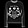
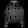
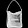
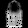
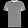
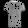

# OCaml autoencoder

A simple linear autoencoder using
[ocaml-torch](https://github.com/LaurentMazare/ocaml-torch) and
[bimage](https://github.com/zshipko/ocaml-bimage). I used the MNIST fashion
dataset but regular MNIST will work just fine too. As few as 10 dimensions in
the bottleneck still works surprisingly well from a subjective evaluation.

## How to run

First you need to extract the MNIST files into a folder called =data= in the
repository root. Then you can build the project with

`dune build`

and start training with

`dune exec ./train.exe`

which should generate a =weights.ot= file that saves the learnt weights. To
preview a comparison of a sample before and after passing through the AE, run 

`dune exec ./compare.exe`

and you should see two new files called =image.jpg= and =processed_image.jpg=.

## Examples

The following (tiny!) examples were generated when training with the defaults.

